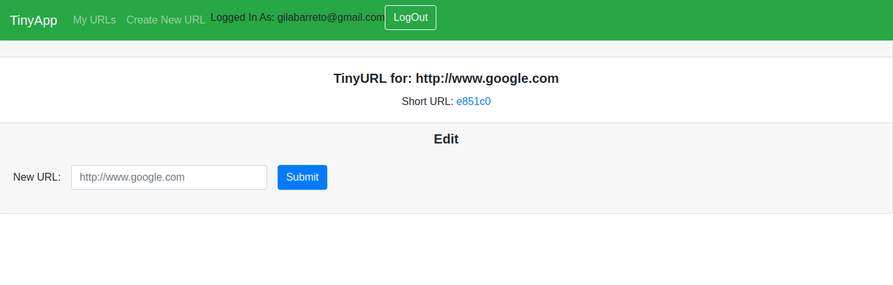

# TinyApp Project

TinyApp is a full stack web application built with Node and Express that allows users to shorten long URLs (à la bit.ly). It's a link management platform that lets you harness the power of your links by shortening, sharing, managing and analyzing links to your content.

## Final Product

### Login Page

### Running App

## Dependencies

- Node.js
- Express
- EJS
- bcrypt
- body-parser
- cookie-session

## Getting Started

- Install all dependencies (using the `npm install` command).
- Run the development web server using the `node express_server.js` command.

## Enjoy!

